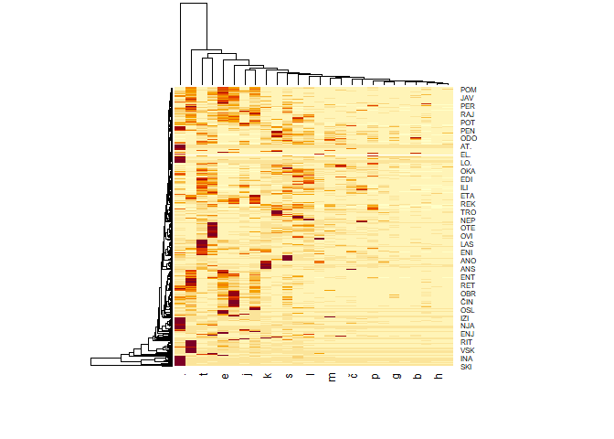

Word Analysis
================
Miha Rupar

- [Data import](#data-import)
- [Data procesing](#data-procesing)
- [Calculate weight](#calculate-weight)
- [Data filtering](#data-filtering)
  - [3](#3)
  - [4](#4)
  - [letter co-occurence](#letter-co-occurence)

## Data import

``` r
url <- 'http://bos.zrc-sazu.si/sbsj.html'
text <- gettxt(url)
```

## Data procesing

Transforming data to get desired outcome for later use

``` r
words <- text %>% str_split("\n") %>% 
  as.data.frame() %>% .[-c(1:5), ] %>%
  as.data.frame() %>% slice(., 1:(n() - 5)) 

colnames(words) <- c("besede")

words <- words %>% mutate(
  besede = besede %>%
    str_replace(" \\s*\\([^\\)]+\\)", "") %>%
    str_replace_all("\xc2\xa0", " ")%>%
    str_replace_all("-"," ") %>%
    str_trim("right") %>%
    str_replace_all(" ",".") %>%
    paste0(".")
)
```

## Calculate weight

Defining weight matrix

``` r
letter <- c("a", "b", "c", "č", "d", "e", "f", "g", "h", "i", "j", "k", "l", 
            "m", "n", "o", "p", "r", "s", "š", "t", "u", "v", "z", "ž",".")
n_letter <- letter

weight_mat <- matrix(0, nrow = 26, ncol = 26)
colnames(weight_mat) <- letter
rownames(weight_mat) <- toupper(letter)
```

Function for adding weights to matrix, based on next character in
string. Ex. “abc” =\> \[a,b\] +1 & \[b,c\] +1

``` r
add_weights <- function(word,lvl){
  if(nchar(word)<lvl+1){return()}
  l1 = substring(toupper(word), 1, lvl)
  l2 = substring(tolower(word), lvl+1, lvl+1)
  if(l1 %in% toupper(n_letter) & l2 %in% tolower(letter)){
    weight_mat[l1, l2] <<- weight_mat[l1, l2] + 1
  }
  cut_word = substring(word, 2)
  add_weights(cut_word,lvl)
}

for (w in 1:nrow(words)){
  add_weights(words$besede[w],1)
}
heatmap(weight_mat)
```

<<<<<<< HEAD
<!-- -->
Visualization of letter to letter relation in slovenian words. Graph
shows most probable letter to follow upercase letters.

=======
Application of weights function on data

``` r
apply(words, 1, function(x) add_weights(x))
```

## Visualization

### heatmap
Darker the spot more possible that uppercase letter is followed by lowercase.
>>>>>>> 02ed2c0030329c5579a5f6611ad2f1adbdc0c8c9
``` r
heatmap(weight_mat)
```

<!-- -->

## Data filtering

To avoid having too large a matrix when guessing the next letter, let’s
eliminate letter relations that do not occur offten and with that make
our matrix smaller \### 2

``` r
filtered_mat <- weight_mat
filtered_mat[filtered_mat < 1500] <- 0
n_letter <- c()
for (i in rownames(filtered_mat)){
  for (j in colnames(filtered_mat)){
    if (filtered_mat[i,j] != 0){
      n_letter <- c(n_letter,paste0(i,j))
    }
  }
}

weight_mat <- matrix(0, ncol = 26, nrow = length(n_letter))
colnames(weight_mat) <- letter
rownames(weight_mat) <- toupper(n_letter)

add_weights <- function(word,lvl){
  if(nchar(word)<lvl+1){return()}
  l1 = substring(toupper(word), 1, lvl)
  l2 = substring(tolower(word), lvl+1, lvl+1)
  if(l1 %in% toupper(n_letter) & l2 %in% tolower(letter)){
    weight_mat[l1, l2] <<- weight_mat[l1, l2] + 1
  }
  cut_word = substring(word, 2)
  add_weights(cut_word,lvl)
}

for (w in 1:nrow(words)){
  add_weights(words$besede[w],2)
}
heatmap(weight_mat)
```

<!-- -->

### 3

``` r
filtered_mat <- weight_mat
filtered_mat[filtered_mat < 1500] <- 0
n_letter <- c()
for (i in rownames(filtered_mat)){
  for (j in colnames(filtered_mat)){
    if (filtered_mat[i,j] != 0){
      n_letter <- c(n_letter,paste0(i,j))
    }
  }
}

weight_mat <- matrix(0, ncol = 26, nrow = length(n_letter))
colnames(weight_mat) <- letter
rownames(weight_mat) <- toupper(n_letter)

add_weights <- function(word,lvl){
  if(nchar(word)<lvl+1){return()}
  l1 = substring(toupper(word), 1, lvl)
  l2 = substring(tolower(word), lvl+1, lvl+1)
  if(l1 %in% toupper(n_letter) & l2 %in% tolower(letter)){
    weight_mat[l1, l2] <<- weight_mat[l1, l2] + 1
  }
  cut_word = substring(word, 2)
  add_weights(cut_word,lvl)
}

for (w in 1:nrow(words)){
  add_weights(words$besede[w],3)
}
heatmap(weight_mat)
```

<!-- -->

### 4

``` r
filtered_mat <- weight_mat
filtered_mat[filtered_mat < 1500] <- 0
n_letter <- c()
for (i in rownames(filtered_mat)){
  for (j in colnames(filtered_mat)){
    if (filtered_mat[i,j] != 0){
      n_letter <- c(n_letter,paste0(i,j))
    }
  }
}

weight_mat <- matrix(0, ncol = 26, nrow = length(n_letter))
colnames(weight_mat) <- letter
rownames(weight_mat) <- toupper(n_letter)

add_weights <- function(word,lvl){
  if(nchar(word)<lvl+1){return()}
  l1 = substring(toupper(word), 1, lvl)
  l2 = substring(tolower(word), lvl+1, lvl+1)
  if(l1 %in% toupper(n_letter) & l2 %in% tolower(letter)){
    weight_mat[l1, l2] <<- weight_mat[l1, l2] + 1
  }
  cut_word = substring(word, 2)
  add_weights(cut_word,lvl)
}

for (w in 1:nrow(words)){
  add_weights(words$besede[w],4)
}
heatmap(weight_mat)
```

<!-- -->

### letter co-occurence
Graph shows which letters are most likely to be present together in a word
``` r
weight_mat %>% as.dfm() %>%
  fcm() %>% textplot_network()
```

<!-- -->
